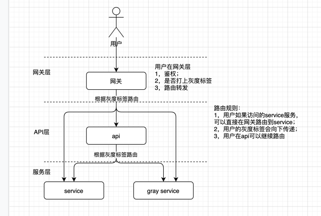
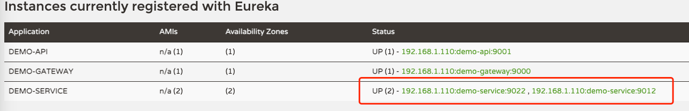

### 项目说明
- 通过eureka的扩展元数据，标记服务是灰度服务
- 重写Ribbon的RoundRobinRule轮训算法实现灰度路由

### 项目结构说明
必须有一个eureka
#### lb-common 公共包
- com.yxkong.common 项目公共信息的封装
- com.yxkong.lb 项目中关于Ribbon相关的封装（注意扫描的域的范围）
    - Label基于RoundRobinRule重写轮询规则实现的路由选择
    - 实现ClientHttpRequestInterceptor 用于spring http调用时添加header将灰度标签向下传递
    - ServletAutoConfiguration 内置interceptor用于springmvc接口前置往HystrixRequestContext中初始化标签以及，请求后的销毁
#### gateway 网关
- 基于bootstrap.yml 配置的网关路由，后续可以直接使用配置中心替换
- AuthGlobalFilter 实现权限的拦截
_- GrayGlobalFilter 实现打灰度标签的功能，基于策略模式实现，配置策略只需要前缀名称即可（后续使用表达式，更方便）
    - RuleStrategy 规则策略接口
    - EqRuleStrategy 等于策略实现
    - Ge/GteRuleStrategy 大于/大于等于策略实现
    - Le/LteRuleStrategy 小于/小于等于策略实现
    - Mod10RuleStrategy 取模策略实现_
```
#启动项目
java -jar  gateway-1.0.jar
```
#### api 提供基于原子服务的封装
引入了lb-common,主要就一个DemoController 
和service都有一个/demo/hello的接口
```
//外部定义的包，要么定义为starter，要么指定具体的包，要不然扫描不到
@SpringBootApplication(scanBasePackages={"com.yxkong"})
@EnableDiscoveryClient
@EnableEurekaClient
@EnableFeignClients(basePackages = {"com.yxkong.api"})
@Import(EurekaMetadata.class)
@RibbonClients(defaultConfiguration = LoadBalanceAutoConfiguration.class)
public class ApiStarter {

    public static void main(String[] args) {
        SpringApplication.run(ApiStarter.class,args);
    }
}
```
启动环境
```
java -jar  api-1.0.jar
```

#### service  原子服务
主要通过yml文件来控制服务是否是灰度，以及对应的标签
application-dev.yml 开发环境
application-gray.yml 灰度环境
```
eureka:
  instance:
    metadata-map:
      version: 2.0
      label: gray
```
可以自己定义什么样的标签是灰度环境
目前 version=2.0  label=gray 是灰度标签
启动环境
```
# 启动开发环境
java -jar -Dspring.profiles.active=dev service-1.0.jar
# 启动灰度环境
java -jar -Dspring.profiles.active=gray service-1.0.jar
```
### 项目部署与调用情况




### 调用请求
查看eureka元数据
```shell
curl http://127.0.0.1:8765/eureka/apps/
```
请求直接由网关路由到灰度到service
```shell
# 灰度用户
curl  'http://127.0.0.1:9000/service/demo/hello' --header 'token: bcd'  --header 'Content-Type: application/json'
#返回结果
{"message":"执行成功！","status":"1","data":"service进入的版本号是：2.0","timestamp":1621607340919}
# 非灰用户
curl  'http://127.0.0.1:9000/service/demo/hello' --header 'token: abc'  --header 'Content-Type: application/json'
{"message":"执行成功！","status":"1","data":"service进入的版本号是：","timestamp":1621611780692}


```
请求直接由网关转发到api再路由到service

```shell
# 灰度用户
curl  'http://127.0.0.1:9000/api/demo/hello' --header 'token: bcd'  --header 'Content-Type: application/json'

curl  'http://127.0.0.1:9000/api/demo/restTemplate' --header 'token: bcd'  --header 'Content-Type: application/json'

{"message":"执行成功！","status":"1","data":"service进入的版本号是：2.0","timestamp":1621611879941}
# 非灰用户
curl  'http://127.0.0.1:9000/api/demo/hello' --header 'token: abc'  --header 'Content-Type: application/json'
#返回结果
{"message":"执行成功！","status":"1","data":"service进入的版本号是：","timestamp":1621611645354}


```
2021-06-27 更新日志
- 添加线程池消费任务的样例；
- 添加非web请求，模拟定时任务或者kafka异步任务处理的demo；


2021-06-29 更新日志
- 实现用户数据从库中查询，并模拟登录，使用jwt生成token（未做安全性优化，最好jwt内容md5作为key，然后和jwt缓存到redis中）
- 实现灰度规则数据库配置
- 使用aviator 替代策略模式实现规则处理；
可用规则字典元数据：
  - userId 用户id  t_account 中的id
  - age  年龄
  - loginSource 登录来源
  - mobile 手机号
  - registerTime 注册时间 
  - mobileMod 手机号取模（%10）
  - userIdMod userId取模（%10）
  
#### 灰度规则使用说明
- t_gray_rule 中只有一条有效数据，否则取id最新的一条；
- rule 为aviator 表达式 返回true或false，异常认为是false
(string.startsWith('9,0',mobileMod) && userId>=901 && registerTime>'2021-06-01 00:00:00')
  以9或0为结尾的手机号 且userId大于等于901， 注册时间大于2021-06-01 00:00:00才是灰度用户
  这块可以灵活配置
  
  
